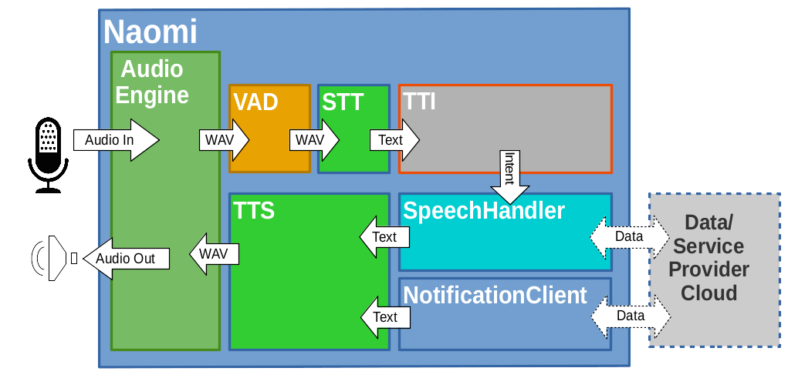

<h1 class="welcome">Welcome to Naomi!</h1>

The Naomi Project is an open source, technology agnostic platform for developing always-on, voice-controlled applications!

Naomi **software** integrates different home text-to-speech & speech-to-text systems, plugins and technologies into a single solution.
It provides uniform user interfaces, and a common approach for developing always-on, voice-controlled applications, regardless of the number of devices and sub-systems involved.

You've reached the Naomi documentation, which contains extensive resources for all users:

- If you are new to Naomi, we recommend to learn a bit about Naomi first before jumping in - please proceed directly to the [Getting Started](#getting-started) chapter below!
- If you're an experienced user, the [Download](/download) page contains links and simplified installation instructions. The [Configuration Guide](./configuration/) and the _Interfaces and Ecosystem_ section below also contain useful information. If you're looking for the documentation of a specific plugins, go to [Plugin Reference](/plugin/). You can also use the search box above to find any page on this site.
- If you're using Jasper 1.x and want to migrate your installation to Naomi 2.x, have a look at our [Migration Guide](./configuration/migration/).
- If you would like to contribute to the development of Naomi, please refer to our [Developer Guide](./developer/).

This documentation is always worked on, so expect regular changes. If you feel that something important is missing, please [help us improve the documentation](https://github.com/naomiproject/naomi-docs/blob/gh-pages/README.md#contributing-to-the-documentation)!

## Getting Started

We highly recommend that you read the next chapter titled [Concepts](./concepts/index.html).
It introduces a number of important ideas that will help you as you install and begin to configure Naomi for the first time.

Naomi runs on many popular platforms including Linux, Windows and Mac OSx.
You can find specific installation instructions for these and other platforms in the [Installation Guide](./installation/).
Many people find that the simplest way to experiment with Naomi is to get a [Raspberry Pi](https://raspberrypi.org) and install [Naobian](./installation/naobian.html) - the "hassle-free Naomi setup".
While Naobian offers a streamlined and simplified way to get up and running quickly, it is a complete platform for developing always-on, voice-controlled applications.

Once you have Naomi up and running, the [Configuration Guide](./configuration/) contains everything you need to know to get your Naomi installation telling you information around your home.
For instance, you can use [Sitemaps](./configuration/sitemaps.html) to control how the status of the information are displayed on different Naomi User Interfaces, and you can begin to experiment with [Rules](./configuration/rules-dsl.html) in order to get the most out of your installation. There are many other ways of interacting with your Naomi Assistant: the most popular are presented in the _Interfaces and Ecosystem_ section below.

Along the way, you may have some questions; the Naomi community is here to help.

## The Naomi Community

Naomi is not just software - it is also a **community** of users, contributors and maintainers, working together on an open-source, interoperable approach to virtual assistance.
The center of this community is the [Naomi community forum](https://community.projectnaomi.com).
You can search previous conversations and issues to see if your question has already been answered.
You can post your own question as well (although it is generally considered to be good etiquette to check fairly thoroughly before posting).
One of the great things about Naomi is that it has an active and responsive community of developers and maintainers who generally respond quite quickly to forum questions.
We believe you will find that our community works diligently to make newcomers feel at home.

## Architecture Overview

Naomi is developed in [Python](https://www.python.org/) and mainly based on the [Jasper](https://jasperproject.github.io/) framework.
[Jetty](https://www.eclipse.org/jetty/) is used as an HTTP server.

Naomi is highly modular software that can be extended through "Plugins".
Plugins give Naomi a wide array of capabilities, from User Interfaces, to the ability to interact with a large and growing number of physical Things.
Plugins may come from the Naomi distribution.

The overall architecture of Naomi is shown in the figure below:

If you are new to Naomi, we suggest you continue to the [Concepts](./concepts/index.html) chapter where we introduce many fundamental ideas that are used throughout Naomi.
